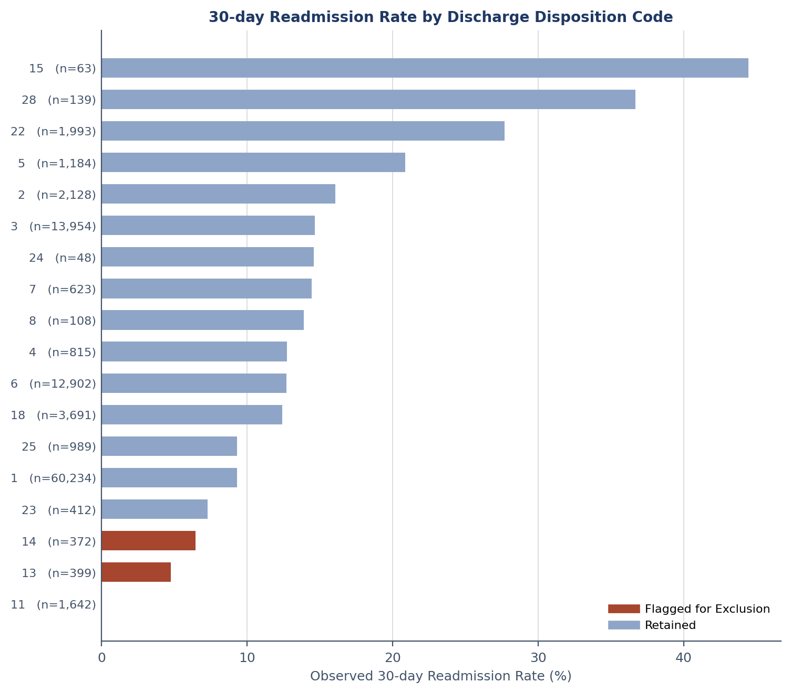
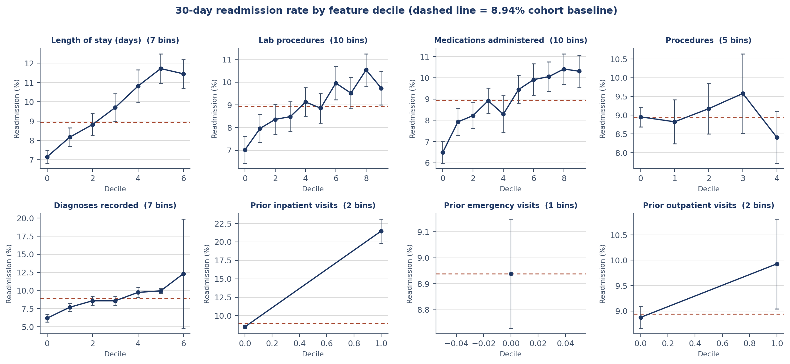

# CareBridge

**Diabetes readmission risk and cardiometabolic comorbidity** — a reproducible analysis pipeline built for a B.S. Data Science capstone.

Two public datasets, two research questions, one DuckDB file that both Python and R query directly. The entire pipeline reproduces from a clean clone on a laptop.

---

## Findings

Four data quality findings changed the analysis. Each is documented with its evidence in `reports/`.

### 1. The conventional leakage exclusion is partly wrong

Published analyses of this dataset commonly drop six discharge disposition codes described collectively as "expired or hospice." Those codes do not behave alike.

| Code | Meaning | n | 30-day readmission | Decision |
|---|---|---|---|---|
| 11, 19, 20 | Expired | 1,652 | **0.000%** | Exclude |
| 13 | Hospice, home | 399 | 4.762% | Retain |
| 14 | Hospice, facility | 372 | 6.452% | Retain |

Readmission is structurally impossible for a patient who died, so retaining those encounters in the negative class is target leakage. Hospice patients are alive and readmit at roughly half the 11.16% baseline — excluding them would discard 771 encounters containing genuine readmission events and bias the cohort toward a healthier population. This pipeline excludes only the expired codes and carries hospice status as a model covariate.

The code list was validated empirically rather than taken from a lookup table, because the Kaggle mirror ships a description PDF in place of `IDs_mapping.csv`.



### 2. The `change` column does not record medication changes

The source dataset includes a column named `change`, widely used as an indicator that diabetic medication was adjusted during the encounter. It is the natural input to any analysis of inpatient medication management.

Across the 14,299 cohort encounters where that flag fires but no individual drug column shows an adjustment, the medication columns contain 267,423 `No` values and 32,856 `Steady` values — and **zero** `Up` or `Down`. Every one of those encounters also has `diabetesMed = Yes`.

The column identifies patients on *continued* medication, not therapeutic adjustment. Its name does not describe its contents. An adjustment indicator derived from the 21 usable drug columns flags 24.65% of encounters against the source flag's 44.95%, and rebuilding the H1b interaction term from it changes that term's prevalence from 10.08% to 6.49%.

### 3. Encoding choice determines whether a variable appears informative

Prior emergency visits are 92.71% zero with excess kurtosis of 1,207.94. Decile analysis collapses to a single bin — every quantile boundary lands on the same value — reporting a readmission spread of exactly 0.00 percentage points.

The same contrast computed as binary gives 11.98% against 8.70%, a 3.28 point difference that ranks the variable above lab procedures. The variable was never uninformative; the encoding could not represent it.



### Statistical results

**H1e supported.** Length of stay shows a variance-to-mean ratio of 2.0174 against the Poisson requirement of 1.0. A boundary-corrected likelihood ratio test rejects Poisson (LR = 19,004.8) and AIC favours the negative binomial by 19,003.

**Effect sizes, not p-values.** Across 14 hypothesis tests with Benjamini-Hochberg FDR control, 13 reach significance but only one exceeds an effect size of 0.1. That gap is the expected pattern at n = 70,436 and the reason results are ordered by magnitude.

---

## Data

| Source | Rows | Grain | Question |
|---|---|---|---|
| [Diabetes 130-US Hospitals](https://archive.ics.uci.edu/dataset/296/) | 101,766 | Inpatient encounter | RQ1 |
| [CDC BRFSS 2015](https://www.cdc.gov/brfss/) | 253,680 | Survey respondent | RQ2 |

Both accessed through Kaggle mirrors; neither is redistributed here. The pipeline downloads them.

After cleaning: **100,111 encounters from 70,423 patients**, 8.93% 30-day readmission in the first-encounter modeling cohort after the 13 unresolved post-expired cases were excluded.

The survey source ships three file variants. The 50/50 rebalanced file is explicitly not used — its artificial class balance would invalidate every prevalence-dependent statistic, and the observed 13.9% prevalence is itself something the analysis studies.

---

## Research questions

**RQ1** — Which patient, encounter, utilization, and medication-management factors predict unplanned 30-day readmission among hospitalized diabetic patients, and can a calibrated model outperform a utilization-history baseline equitably across demographic subgroups?

**RQ2** — Which behavioral, clinical, and socioeconomic indicators are the strongest predictors of diabetes, stroke, and myocardial infarction; do those rankings differ across the three conditions; and which existing diagnosis is most strongly associated with the presence of an additional condition?

---

## Architecture

```
data/raw/          source files (gitignored, regenerated by the pipeline)
sql/01_bronze/     land raw data unchanged, all_varchar, lineage columns
sql/02_silver/     typed, sentinels resolved, leakage removed, DQ tables
sql/03_gold/       star schema, ICD-9 grouping, window features, ML cohort
src/carebridge/    ingest, features, stats, viz, reports
tests/             unit tests on feature derivation and model specification
reports/           figures, tables, generated documents
notebooks/         EDA notebook
```

Bronze reads every column as text. That is deliberate: the source uses `?` as a missing sentinel, and type inference makes a nondeterministic per-column judgement about it depending on where sentinels fall in the sample. Casting happens explicitly in Silver, where it is visible and testable.

Data quality metrics are persisted as queryable tables (`silver.dq_report`, `silver.disposition_audit`) rather than printed, so every exclusion count in the write-up is traceable to a rebuilt artifact.

---

## Reproducing

Requires **Python 3.12** — the scientific stack lags the interpreter and 3.13+ has no prebuilt wheels for several pinned dependencies — plus a Kaggle API token.

```bash
git clone https://github.com/antoinewrd1/carebridge-diabetes-platform.git
cd carebridge-diabetes-platform

uv venv --python 3.12 .venv && source .venv/bin/activate
uv pip install -r requirements.txt && uv pip install -e .

# Kaggle credentials: ~/.kaggle/kaggle.json (chmod 600),
# or export KAGGLE_USERNAME and KAGGLE_KEY

python -m carebridge.ingest.download        # fetch sources
python -m carebridge.ingest.build_db        # bronze -> silver -> gold
python -m pytest tests/ -q                  # 15 tests
python -m carebridge.viz.eda                # EDA figures and tables
python -m carebridge.stats.distributions    # H1e
python -m carebridge.stats.tests            # hypothesis family\npython -m carebridge.models.readmission_models  # OOF model comparison\npython -m carebridge.models.calibration         # probability calibration
```

`python check_sql.py` runs every SQL file in dependency order and stops at the first failure — useful while editing the layers.

---

## Method notes

**Patient-grouped splitting is mandatory.** 100,111 encounters come from 70,423 patients; some contribute more than one. A naive random split leaks patient-specific information across the partition and inflates measured performance.

**Precision-recall over ROC.** Prevalence runs 4.1% to 13.9% across the four outcomes, and ROC-AUC flatters models on imbalanced data.

**Out-of-fold predictions are the evaluation substrate.** Model discrimination and calibration use predictions generated on patients held outside each model's training fold. Threshold analysis is treated separately because choosing a cutoff from the same outcomes used for evaluation can make the reported operating point optimistic.\n\n**Effect sizes accompany every p-value.** At these sample sizes significance is nearly uninformative; interpretation is driven by magnitude, and the multiple comparison correction is fixed before results are read.

**Boundary-corrected likelihood ratio tests.** Testing a dispersion parameter against zero places the null on the edge of the parameter space, so the reference distribution is a 50:50 mixture of chi-squared(0) and chi-squared(1) and the naive p-value is halved.

**Winsorization is specified per variable.** Tukey's fence flags 3,851 records on a variable that ranges 0 to 6 — the rule applied outside its domain. Blanket outlier policies are not used.

---

## Documents

- `notebooks/CareBridge_EDA.ipynb` — exploratory analysis, executable
- `reports/tables/` — every statistic cited above, as generated CSVs
- Data Quality Assessment, Project Plan, and Research Questions

---

## Stack

Python 3.12 · DuckDB · pandas · NumPy · SciPy · statsmodels · scikit-learn · XGBoost · matplotlib · pytest

---

## Reference

Strack, B., DeShazo, J. P., Gennings, C., Olmo, J. L., Ventura, S., Cios, K. J., & Clore, J. N. (2014). Impact of HbA1c Measurement on Hospital Readmission Rates: Analysis of 70,000 Clinical Database Patient Records. *BioMed Research International*, 2014, Article 781670.
