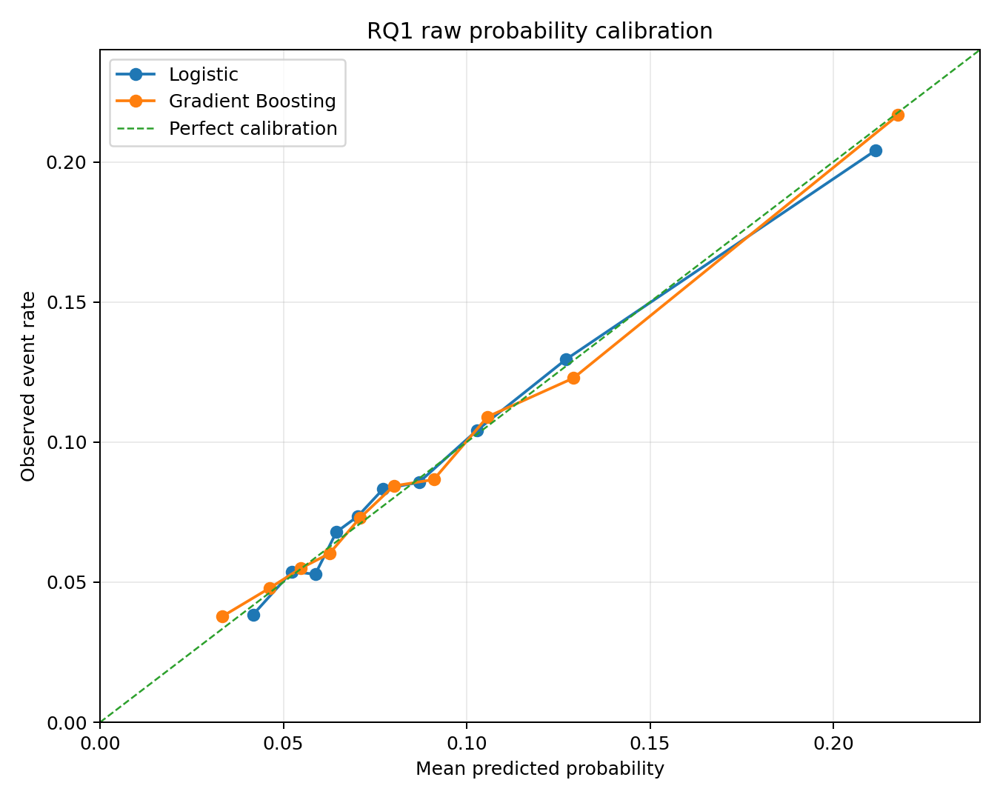
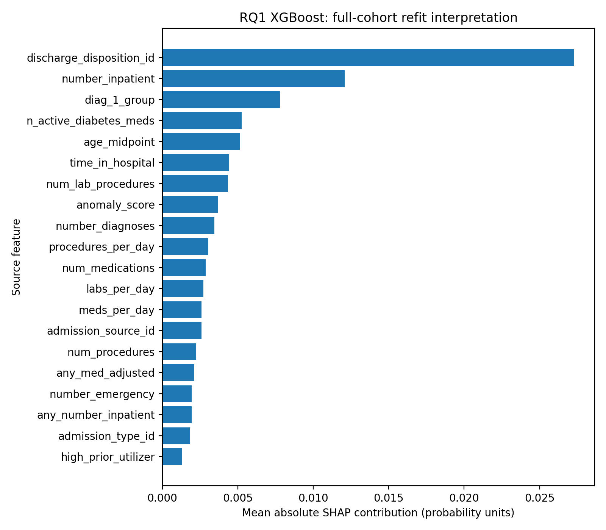
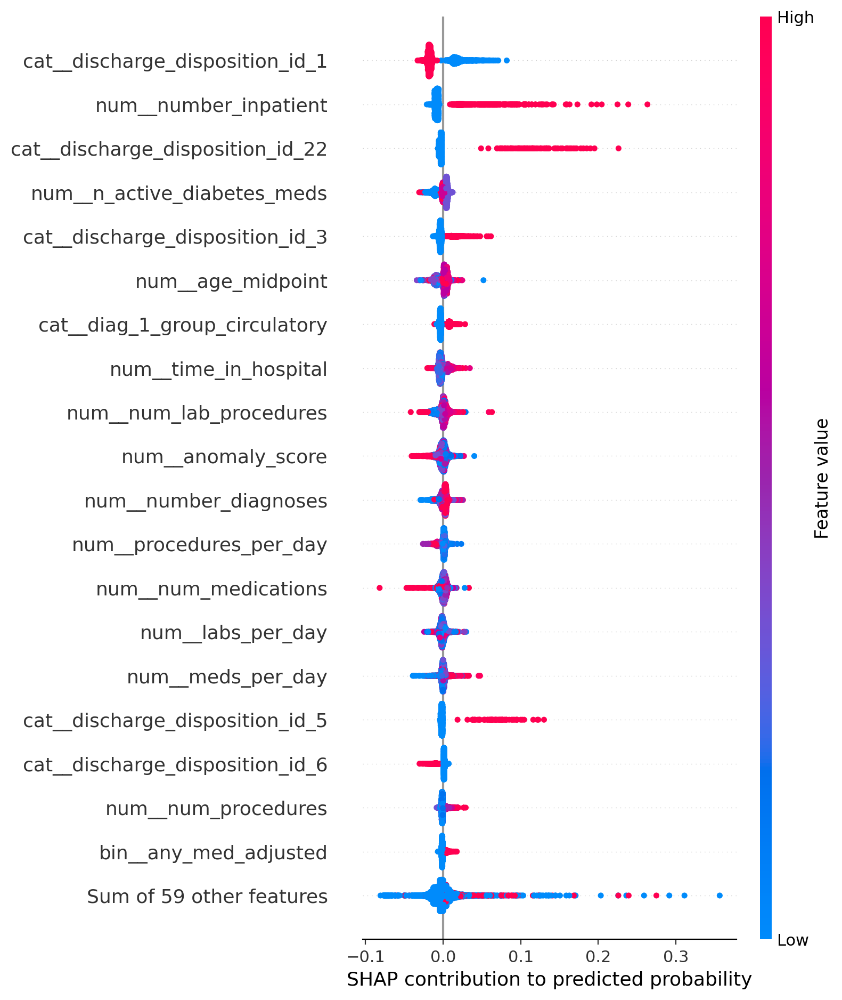
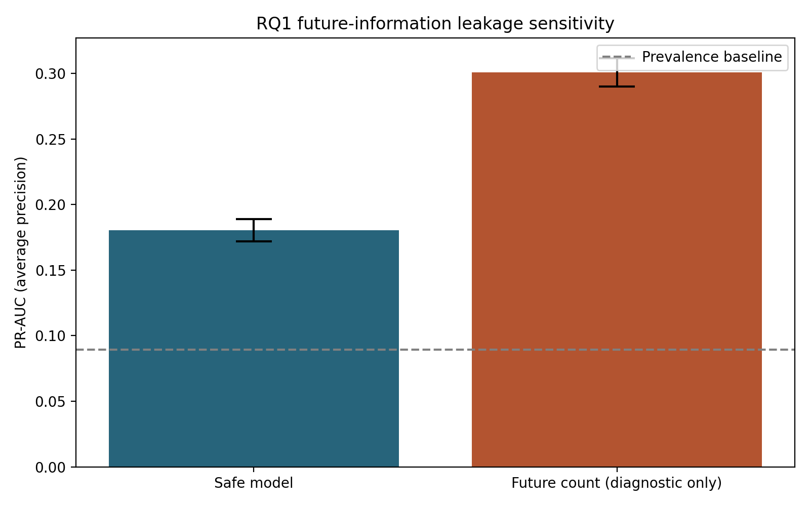
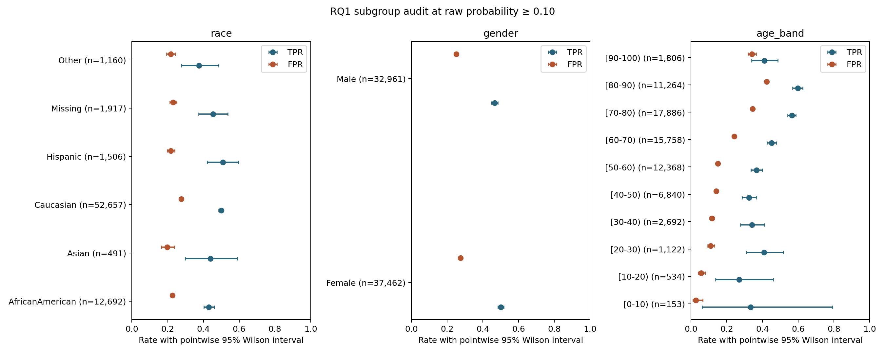
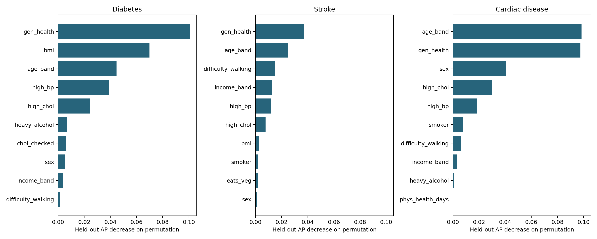
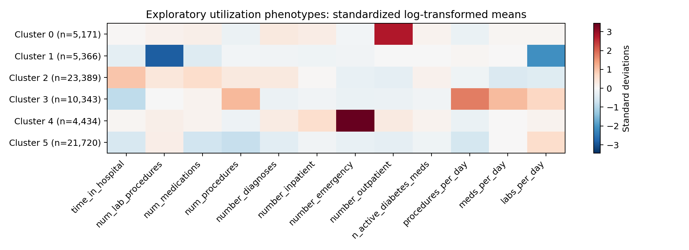

# CareBridge: Diabetes Readmission and Cardiometabolic Comorbidity
Antoine Ward | B.S. Data Science capstone | 2026-09-24

## Contents

Abstract

Executive summary

1. Introduction

2. Research questions

3. Data preparation

4. Methodology

5. Analysis

6. Recommendations

7. Challenges and limitations

8. References

Appendix

## Abstract

This study examined readmission prediction in 70,423 patients with diabetes and cardiometabolic associations in 253,680 BRFSS respondents. Patient-grouped cross-validation yielded XGBoost average precision (AP) 0.1805 (95% interval 0.1721–0.1889) at 8.93% event prevalence. Adding a deliberately unavailable future encounter count increased AP by 0.1204, illustrating the impact of information leakage. SHAP described the fitted model; threshold audits quantified demographic differences. Three parallel survey models, nested likelihood tests, and adjusted comorbidity models characterized cross-sectional associations. An MLP and outcome-blind clustering extended the analysis. Results support further validation, with substantial limits from historical data, sample selection, missing survey-design fields, and observational measurement.

## Executive summary

XGBoost exceeded the utilization-history rule (AP 0.1116) and logistic regression (0.1643). Its lift over prevalence was 2.02. The raw probabilities were audited for calibration but were not recalibrated. Group error rates vary at a shared cutoff, so aggregate accuracy cannot establish equitable performance. The future-count model is retained solely as a diagnostic. The BRFSS outcomes measure existing diagnosed conditions, and cardiac disease is a combined heart disease/angina/heart attack indicator. All survey percentages are unweighted sample statistics. The deliverable includes code, tables, figures, this report, and a reproducible runner.

## 1. Introduction

CareBridge connects two analytic questions: identifying patterns associated with early readmission after a diabetes hospitalization, and comparing correlates of diabetes, stroke, and cardiac disease in a community survey. The sources differ in time, population, and unit of observation, so they are analyzed separately. The hospital dataset covers 1999–2008 [1]; the survey extract derives from 2015 BRFSS [2, 3]. Neither analysis estimates intervention effects.

## 2. Research questions

RQ1: Which patient, encounter, utilization, and medication-management factors predict 30-day readmission, and how do discrimination, calibration, and subgroup error rates compare? The proposal's intent concerns unplanned readmission, but the supplied target does not distinguish planned readmissions. The available predictors support scoring at discharge.

RQ2: Which behavioral, clinical, and socioeconomic indicators predict each survey condition, how do their rankings differ, and which existing diagnoses are most strongly associated with another condition? This is concurrent disease classification, not a prospective incidence model.

The original verbatim H2a–H2d statements were unavailable in the repository. This report uses the working definitions in analysis_specification.md: H2a tests the clinical/behavioral block; H2b tests the socioeconomic/access block; H2c describes ranking differences; H2d examines adjusted comorbidity. These are exploratory operational definitions, not a claim of preregistration. H1d has no supplied parity margin, so the audit cannot declare equivalence or certify fairness.

## 3. Data preparation

Bronze preserves raw strings and lineage. Silver casts types, resolves sentinels, and applies eligibility rules. Gold groups primary diagnoses, derives encounter order, and selects each patient's first retained encounter. Encounter ID is an ordering proxy because admission dates are unavailable. Expired discharges are outside the population at risk for subsequent readmission; hospice is retained. Patients with apparent post-expired encounters are excluded as unresolved records. These are eligibility and data-quality decisions; the deliberate future-count feature is a separate temporal-leakage experiment. Stable patient/encounter sorting makes CV input order repeatable.

Medication adjustment is defined as any individual drug marked Up or Down. The original change flag also occurs with No/Steady drug entries and therefore does not isolate this dose-adjustment construct. This finding does not establish that no medication initiation or other treatment change occurred. Features include medication counts, service counts per day, prior utilization, and an Isolation Forest anomaly score. Race is reserved for audit; age and recorded gender remain predictors.

BRFSS uses the unrebalanced 253,680-row binary extract, not the 50/50 variant. All three outcome columns are excluded from the shared predictive feature set. Other diagnosis indicators enter only the separate, explicitly cross-sectional comorbidity models. Survey weights, strata, and primary sampling units are absent from this mirror, which limits population inference [2, 3].

## 4. Methodology

### 4.1 Readmission prediction and uncertainty

The utilization rule, logistic regression, linear SVM, and XGBoost were compared on five StratifiedGroupKFold partitions (seed 42). Anomaly detection, scaling, and categorical encoding were fitted inside each training fold. One patient contributes one primary row. AP is the reported PR-AUC convention, with ROC-AUC secondary. Paired percentile intervals use 1,000 patient bootstrap resamples of fixed OOF scores. They do not include model-refit or selection uncertainty. No cutoff was optimized on these outcomes.

### 4.2 Calibration, explanation, and sensitivity

Raw OOF probability calibration uses Brier score, a joint logistic intercept/slope fit, and ten quantile bins. The scikit-learn return order is observed fraction followed by mean prediction [4]. SHAP explains the full-cohort XGBoost refit using 5,000 sampled observations, an explicit 100-row background, and interventional probability output [5]. Base value plus contributions must reconstruct each prediction within numerical tolerance. Source-level importance sums signed one-hot contributions per patient before taking absolute magnitudes. This is descriptive model attribution, not causal inference or a new performance estimate. Correlated and derived features complicate individual attribution.

The sensitivity experiment adds patient_encounter_count to an otherwise identical pipeline on identical materialized folds. This count includes later retained encounters and is unavailable at the index discharge. The primary feature allowlist continues to exclude it. Subgroup audits report TPR and FPR at 0.05, 0.10, 0.15, 0.20, and 0.25 with pointwise Wilson 95% intervals. Zero denominators produce undefined rates. Descriptive max–min gaps exclude denominators below 20; all group counts remain available. The displayed 0.10 cutoff is illustrative.

### 4.3 Survey models and hypothesis tests

Three common logistic specifications use five shared folds stratified by the joint outcome pattern. Age, general health, education, and income bands are one-hot encoded; continuous predictors are standardized inside folds. AP intervals use 300 respondent-row resamples. Held-out permutation importance uses 5,000 validation rows per fold and three repeats; the reported standard deviation is repeat/fold variability, not a confidence interval. Separate unpenalized logistic association models estimate odds ratios and nested likelihood-ratio tests on identical rows. Benjamini–Hochberg correction is applied separately to nested tests, comorbidity terms, and the coefficient table. Standard errors assume independent records and do not account for the unavailable survey design.

### 4.4 Neural benchmark and phenotyping

The Keras benchmark uses 64 and 32 ReLU units, dropout 0.2, a sigmoid output, Adam at 0.001, batch size 512, and exactly 20 training epochs per fold. Test patients never influence preprocessing or stopping. It is compared with XGBoost using paired OOF AP. Exploratory K-means phenotypes use 12 utilization inputs after log1p and standardization; outcomes are excluded. The cluster count (2–6) is selected by silhouette on a fixed sample, then refitted on the full cohort. A second seed provides an adjusted Rand agreement check. Post-fit event rates describe the clusters and do not independently validate them.

## 5. Analysis

### 5.1 Model discrimination and existing hypotheses

Table 1. RQ1 OOF discrimination; PR-AUC denotes average precision.

| model | pr_auc | ci_low | ci_high | roc_auc |
| --- | --- | --- | --- | --- |
| prevalence | 0.0893 | — | — | 0.5000 |
| rule_baseline | 0.1116 | 0.1075 | 0.1159 | 0.5479 |
| logistic | 0.1643 | 0.1575 | 0.1716 | 0.6465 |
| linear_svm | 0.1622 | 0.1557 | 0.1695 | 0.6477 |
| gradient_boosting | 0.1805 | 0.1721 | 0.1889 | 0.6572 |

H1c: the paired XGBoost-minus-logistic bootstrap mean AP difference was 0.0161 (0.0115 to 0.0208). The difference is positive in the reported interval. This comparison remains conditional on the chosen feature set, models, and cohort.

H1b: the dose-adjustment interaction OR was 0.914 (0.790–1.057); p=0.2237. An interaction coefficient modifies the product of main-effect odds ratios; it is not the combined group's standalone odds ratio. These observational estimates do not identify a treatment benefit. H1e: length-of-stay variance/mean was 2.0175; the boundary-corrected Poisson-versus-negative-binomial LR statistic was 19004.6. The fitted negative binomial improves likelihood, but the observed stay range is restricted to 1–14 days and untruncated distribution fits remain approximations.

### 5.2 Calibration and SHAP

Table 2. Raw OOF calibration.

| model | brier_score | calibration_intercept | calibration_slope |
| --- | --- | --- | --- |
| logistic | 0.0790 | -0.0882 | 0.9601 |
| gradient_boosting | 0.0784 | -0.0677 | 0.9680 |

Table 3. Ten highest source-level SHAP magnitudes; units are probability contributions.

| source_feature | mean_abs_shap | importance_pct |
| --- | --- | --- |
| discharge_disposition_id | 0.0273 | 26.2217 |
| number_inpatient | 0.0121 | 11.6205 |
| diag_1_group | 0.0078 | 7.4917 |
| n_active_diabetes_meds | 0.0052 | 5.0458 |
| age_midpoint | 0.0051 | 4.9225 |
| time_in_hospital | 0.0044 | 4.2633 |
| num_lab_procedures | 0.0044 | 4.1920 |
| anomaly_score | 0.0037 | 3.5508 |
| number_diagnoses | 0.0034 | 3.3054 |
| procedures_per_day | 0.0030 | 2.8947 |

### 5.3 Leakage sensitivity

Table 4. Identical-fold comparison with and without future encounter count.

| scenario | pr_auc | ci_low | ci_high | roc_auc |
| --- | --- | --- | --- | --- |
| safe_model | 0.1805 | 0.1721 | 0.1889 | 0.6572 |
| with_future_count | 0.3009 | 0.2901 | 0.3117 | 0.8089 |

The observed AP increase was 0.1204, with paired 95% interval 0.1119–0.1291. This is apparent performance obtained using unavailable information; it must not be reported as a valid model improvement.

### 5.4 H1d subgroup audit

Table 5. Descriptive subgroup ranges at the illustrative 0.10 threshold.

| attribute | metric | eligible_groups | max_minus_min |
| --- | --- | --- | --- |
| age_band | tpr | 9 | 0.3279 |
| age_band | fpr | 10 | 0.3965 |
| gender | tpr | 2 | 0.0346 |
| gender | fpr | 2 | 0.0225 |
| race | tpr | 6 | 0.1332 |
| race | fpr | 6 | 0.0788 |

Differences in observed error rates require investigation and cannot be dismissed because race was excluded from predictors. Small groups have wider uncertainty. Marginal intervals and max–min ranges do not constitute a simultaneous test or an equivalence assessment. H1d is addressed descriptively; a binary fairness conclusion is not identified without a prespecified tolerance, deployment context, and independent validation.

### 5.5 RQ2 and working H2a–H2d

Table 6. Three survey outcome models; sample-level OOF performance.

| outcome | prevalence | pr_auc | ci_low | ci_high | roc_auc |
| --- | --- | --- | --- | --- | --- |
| has_diabetes | 0.1393 | 0.4111 | 0.4055 | 0.4160 | 0.8232 |
| has_stroke | 0.0406 | 0.1529 | 0.1474 | 0.1583 | 0.8127 |
| has_cardiac | 0.0942 | 0.3471 | 0.3407 | 0.3533 | 0.8406 |

Table 7. Working H2a/H2b nested likelihood tests.

| outcome | comparison | lr_statistic | df | p_adj_bh |
| --- | --- | --- | --- | --- |
| has_diabetes | H2a_clinical_behavior | 32656.4874 | 16 | <1e-300 |
| has_diabetes | H2b_socioeconomic | 502.6902 | 14 | 3.74e-98 |
| has_stroke | H2a_clinical_behavior | 8406.1140 | 16 | <1e-300 |
| has_stroke | H2b_socioeconomic | 448.1408 | 14 | 1.06e-86 |
| has_cardiac | H2a_clinical_behavior | 18649.9969 | 16 | <1e-300 |
| has_cardiac | H2b_socioeconomic | 347.0745 | 14 | 1.69e-65 |

At BH-adjusted alpha 0.05, 6 of 6 block-addition tests reject their reduced specifications. Large samples can detect small incremental effects; these p-values do not measure predictive or practical value. H2c is described by held-out permutation rankings and their Spearman agreement below, without a formal equality claim.

The three largest held-out permutation AP losses for has_cardiac were age_band, gen_health, sex. These ranks reflect the fitted specification and predictor dependence.

The three largest held-out permutation AP losses for has_diabetes were gen_health, bmi, age_band. These ranks reflect the fitted specification and predictor dependence.

The three largest held-out permutation AP losses for has_stroke were gen_health, age_band, difficulty_walking. These ranks reflect the fitted specification and predictor dependence.

Table 8. Descriptive agreement between outcome predictor rankings.

| outcome_a | outcome_b | spearman_rank_correlation |
| --- | --- | --- |
| has_diabetes | has_stroke | 0.7193 |
| has_diabetes | has_cardiac | 0.6930 |
| has_stroke | has_cardiac | 0.7649 |

Table 9. Working H2d: directed comorbidity associations adjusted for shared covariates and the third diagnosis.

| outcome | existing_condition | conditional_prevalence | adjusted_odds_ratio | or_ci_low | or_ci_high |
| --- | --- | --- | --- | --- | --- |
| has_diabetes | has_stroke | 0.3175 | 1.1748 | 1.1187 | 1.2338 |
| has_diabetes | has_cardiac | 0.3297 | 1.2894 | 1.2453 | 1.3351 |
| has_stroke | has_diabetes | 0.0925 | 1.2011 | 1.1436 | 1.2615 |
| has_stroke | has_cardiac | 0.1648 | 2.6168 | 2.4952 | 2.7443 |
| has_cardiac | has_diabetes | 0.2229 | 1.3325 | 1.2867 | 1.3800 |
| has_cardiac | has_stroke | 0.3825 | 2.6584 | 2.5342 | 2.7888 |

For has_cardiac, has_stroke had the largest adjusted odds-ratio point estimate (2.658; 2.534–2.789). Ranking point estimates does not establish that competing associations differ significantly.

For has_diabetes, has_cardiac had the largest adjusted odds-ratio point estimate (1.289; 1.245–1.335). Ranking point estimates does not establish that competing associations differ significantly.

For has_stroke, has_cardiac had the largest adjusted odds-ratio point estimate (2.617; 2.495–2.744). Ranking point estimates does not establish that competing associations differ significantly.

### 5.6 MLP and exploratory phenotypes

Table 10. Exploratory neural-network benchmark.

| model | n | pr_auc | ci_low | ci_high | roc_auc |
| --- | --- | --- | --- | --- | --- |
| keras_mlp | 70423 | 0.1706 | 0.1632 | 0.1787 | 0.6538 |
| gradient_boosting | 70423 | 0.1805 | 0.1721 | 0.1889 | 0.6572 |

MLP minus XGBoost AP was -0.0099, with paired interval -0.0136–-0.0062. No neural hyperparameter search was performed. Model selection on this cohort requires a separate external evaluation.

Table 11. Phenotype size, post-fit event rate, and agreement across two seeds.

| cluster | n | event_rate | ci_low | ci_high | seed_stability_ari |
| --- | --- | --- | --- | --- | --- |
| 0 | 5171 | 0.1019 | 0.0940 | 0.1105 | 0.7584 |
| 1 | 5366 | 0.0703 | 0.0637 | 0.0774 | 0.7584 |
| 2 | 23389 | 0.1071 | 0.1032 | 0.1111 | 0.7584 |
| 3 | 10343 | 0.0652 | 0.0606 | 0.0701 | 0.7584 |
| 4 | 4434 | 0.1227 | 0.1134 | 0.1327 | 0.7584 |
| 5 | 21720 | 0.0767 | 0.0732 | 0.0803 | 0.7584 |

## 6. Recommendations

Retain the leakage-safe feature contract and validate predictor availability at discharge. Evaluate the frozen pipeline on newer data from independent institutions before considering operational use. Fit any probability recalibration within training folds or on a separate calibration set. Select operating points using a stated workload and error-cost objective, then assess uncertainty on independent patients. Reassess subgroup errors with adequate event counts and prespecified disparity tolerances. Obtain the original weighted BRFSS design variables for population inference. Treat comorbidity and phenotype results as hypothesis-generating associations, not individual care recommendations.

## 7. Challenges and limitations

The principal challenges were temporal leakage, ambiguous medication coding, sparse prior utilization counts, and unequal subgroup precision. Calibration plotting originally swapped observed and predicted outputs; a regression test now verifies the exported columns. SHAP aggregation now preserves signed dummy contributions before calculating magnitudes. Stable cohort ordering and pinned dependencies reduce reproducibility drift. Patient-level predictions and explanations stay in the ignored local data directory; published outputs are aggregate.

Residual limits include historical and selected hospital data, absent admission dates and planned-readmission flags, possible missed care outside participating hospitals, use of encounter ID as chronology, observational confounding, and selection of the first retained encounter. Goodness-of-fit rejection is expected with large samples; continuous fits to integer length of stay are descriptive comparisons rather than proof of an underlying continuous distribution. BRFSS is self-reported, cross-sectional, and unweighted here. Symptoms, general health, and diagnoses can be jointly determined. Survey-response patterns cannot identify unique people or households in this extract. Bootstrap uncertainty is conditional on existing OOF predictions. SHAP background choice, correlated predictors, permutation dependence, and cluster selection can change rankings. The original formal H2 statements and institutional submission template must be reconciled with the separate course materials before submission.

## 8. References

[1] Clore, Cios, DeShazo, and Strack (2014). Diabetes 130-US Hospitals for Years 1999–2008. UCI Machine Learning Repository. https://doi.org/10.24432/C5230J

[2] CDC. 2015 BRFSS Survey Data and Documentation. https://www.cdc.gov/brfss/annual_data/annual_2015.html

[3] CDC. BRFSS 2015 Codebook. https://www.cdc.gov/brfss/annual_data/2015/pdf/codebook15_llcp.pdf

[4] Scikit-learn 1.5. calibration_curve API documentation. https://scikit-learn.org/1.5/modules/generated/sklearn.calibration.calibration_curve.html

[5] SHAP. TreeExplainer API documentation. https://shap.readthedocs.io/en/stable/generated/shap.TreeExplainer.html

[6] Strack et al. (2014). Impact of HbA1c Measurement on Hospital Readmission Rates: Analysis of 70,000 Clinical Database Patient Records. BioMed Research International, 781670. https://doi.org/10.1155/2014/781670

[7] Dataset mirrors: https://www.kaggle.com/datasets/brandao/diabetes and https://www.kaggle.com/datasets/alexteboul/diabetes-health-indicators-dataset. Original source documentation takes precedence over mirror descriptions.

## Appendix

### A. Reproduction and artifact provenance

Install Python 3.12 and requirements.txt, install the local package, configure Kaggle credentials, run python -m carebridge.ingest.download, and run python -m carebridge.run_analysis. The runner executes sequentially with bounded thread counts. Each analysis also runs as its own module. analysis_manifest.json records package versions and SHA-256 hashes of input files and result tables. analysis_specification.md records feature, uncertainty, and hypothesis-label conventions. The table of contents is assembled from this report's fixed section list; it contains section titles rather than renderer-dependent page numbers.

Appendix table A1: rq1_model_comparisons.csv

| comparison | mean_diff | ci_low | ci_high | excludes_zero |
| --- | --- | --- | --- | --- |
| gradient_boosting - logistic | 0.0161 | 0.0115 | 0.0208 | True |
| linear_svm - logistic | -0.0022 | -0.0031 | -0.0013 | True |
| gradient_boosting - rule_baseline | 0.0689 | 0.0623 | 0.0756 | True |
| logistic - rule_baseline | 0.0528 | 0.0479 | 0.0581 | True |

Appendix table A2: rq1_threshold_analysis.csv

| rule | threshold | flagged_n | sensitivity_recall | ppv_precision | f1 |
| --- | --- | --- | --- | --- | --- |
| probability | 0.0500 | 56911 | 0.9084 | 0.1004 | 0.1808 |
| probability | 0.1000 | 19947 | 0.4845 | 0.1528 | 0.2323 |
| probability | 0.1500 | 6763 | 0.2345 | 0.2181 | 0.2260 |
| probability | 0.2000 | 3155 | 0.1369 | 0.2729 | 0.1823 |
| probability | 0.2500 | 1673 | 0.0871 | 0.3276 | 0.1376 |
| top_5pct_risk | 0.1915 | 3522 | 0.1470 | 0.2626 | 0.1885 |
| top_10pct_risk | 0.1479 | 7043 | 0.2426 | 0.2167 | 0.2289 |
| top_20pct_risk | 0.1151 | 14085 | 0.3801 | 0.1698 | 0.2347 |

Appendix table A3: rq1_calibration.csv

| model | bin | mean_predicted_probability | observed_event_rate |
| --- | --- | --- | --- |
| logistic | 1 | 0.0418 | 0.0385 |
| logistic | 2 | 0.0523 | 0.0538 |
| logistic | 3 | 0.0587 | 0.0528 |
| logistic | 4 | 0.0645 | 0.0679 |
| logistic | 5 | 0.0703 | 0.0735 |
| logistic | 6 | 0.0772 | 0.0832 |
| logistic | 7 | 0.0870 | 0.0856 |
| logistic | 8 | 0.1028 | 0.1042 |
| logistic | 9 | 0.1271 | 0.1295 |
| logistic | 10 | 0.2116 | 0.2042 |
| gradient_boosting | 1 | 0.0333 | 0.0378 |
| gradient_boosting | 2 | 0.0462 | 0.0479 |
| gradient_boosting | 3 | 0.0547 | 0.0550 |
| gradient_boosting | 4 | 0.0626 | 0.0602 |
| gradient_boosting | 5 | 0.0709 | 0.0730 |
| gradient_boosting | 6 | 0.0801 | 0.0844 |
| gradient_boosting | 7 | 0.0910 | 0.0866 |
| gradient_boosting | 8 | 0.1057 | 0.1091 |
| gradient_boosting | 9 | 0.1291 | 0.1228 |
| gradient_boosting | 10 | 0.2176 | 0.2167 |

Appendix table A4: h1b_adjusted_odds.csv

| term | odds_ratio | ci_low | ci_high | p_value |
| --- | --- | --- | --- | --- |
| const | 0.0296 | 0.0254 | 0.0345 | <1e-300 |
| HbA1c measured | 0.9724 | 0.8916 | 1.0605 | 0.5265 |
| Medication adjusted | 1.1504 | 1.0731 | 1.2333 | 7.93e-05 |
| Both (interaction) | 0.9139 | 0.7905 | 1.0565 | 0.2237 |
| Diagnoses recorded | 1.0369 | 1.0217 | 1.0524 | 1.50e-06 |
| Active diabetes agents | 1.0085 | 0.9791 | 1.0388 | 0.5756 |
| Length of stay | 1.0415 | 1.0316 | 1.0516 | 8.77e-17 |
| Medications administered | 1.0042 | 1.0002 | 1.0081 | 0.0371 |
| Procedures | 0.9804 | 0.9642 | 0.9969 | 0.0198 |
| Any prior inpatient | 1.8855 | 1.7612 | 2.0186 | 3.10e-74 |
| Any prior emergency | 1.2440 | 1.1349 | 1.3635 | 3.12e-06 |
| Any prior outpatient | 1.0403 | 0.9646 | 1.1219 | 0.3054 |
| Age (band midpoint) | 1.0084 | 1.0066 | 1.0102 | 4.59e-20 |
| Hospice discharge | 0.2855 | 0.1729 | 0.4712 | 9.48e-07 |

Appendix table A5: rq1_hypothesis_tests.csv

| test | effect_size | p_adj | n |
| --- | --- | --- | --- |
| mannwhitneyu:  time_in_hospital | 0.1177 | 3.97e-54 | 70423 |
| mannwhitneyu:  number_inpatient | 0.0958 | 6.54e-111 | 70423 |
| mannwhitneyu:  num_medications | 0.0853 | 1.05e-28 | 70423 |
| chi2: high_prior_utilizer | 0.0830 | 3.33e-106 | 70423 |
| chi2: any_number_inpatient | 0.0819 | 5.91e-104 | 70423 |
| mannwhitneyu:  number_diagnoses | 0.0803 | 4.35e-28 | 70423 |
| mannwhitneyu:  num_lab_procedures | 0.0648 | 3.00e-17 | 70423 |
| chi2: age_band | 0.0508 | 5.38e-34 | 70423 |
| chi2: diag_1_group | 0.0429 | 1.46e-20 | 70423 |
| chi2: any_med_adjusted | 0.0235 | 7.24e-10 | 70423 |
| chi2: race | 0.0159 | 0.0039 | 70423 |
| chi2: is_hospice | 0.0155 | 6.70e-05 | 70423 |
| chi2: a1c_tested | 0.0091 | 0.0182 | 70423 |
| chi2: a1c_tested_and_changed | 0.0008 | 0.8539 | 70423 |

Appendix table A6: rq2_importance.csv

| outcome | feature | mean_ap_decrease | repeat_sd | rank |
| --- | --- | --- | --- | --- |
| has_diabetes | age_band | 0.0448 | 0.0092 | 3 |
| has_diabetes | sex | 0.0054 | 0.0037 | 8 |
| has_diabetes | bmi | 0.0700 | 0.0180 | 2 |
| has_diabetes | high_bp | 0.0387 | 0.0101 | 4 |
| has_diabetes | high_chol | 0.0242 | 0.0102 | 5 |
| has_diabetes | chol_checked | 0.0064 | 0.0038 | 7 |
| has_diabetes | smoker | 0.0004 | 0.0005 | 12 |
| has_diabetes | phys_activity | -7.97e-05 | 0.0005 | 17 |
| has_diabetes | eats_fruit | 4.79e-05 | 0.0004 | 15 |
| has_diabetes | eats_veg | -0.0001 | 0.0003 | 18 |
| has_diabetes | heavy_alcohol | 0.0067 | 0.0023 | 6 |
| has_diabetes | gen_health | 0.1007 | 0.0096 | 1 |
| has_diabetes | mental_health_days | 0.0003 | 0.0004 | 13 |
| has_diabetes | phys_health_days | 0.0007 | 0.0009 | 11 |
| has_diabetes | difficulty_walking | 0.0013 | 0.0016 | 10 |
| has_diabetes | education | -0.0004 | 0.0014 | 19 |
| has_diabetes | income_band | 0.0038 | 0.0032 | 9 |
| has_diabetes | has_coverage | 1.10e-05 | 0.0004 | 16 |
| has_diabetes | skipped_care_cost | 7.64e-05 | 0.0003 | 14 |
| has_stroke | age_band | 0.0251 | 0.0148 | 2 |
| has_stroke | sex | 0.0009 | 0.0044 | 10 |
| has_stroke | bmi | 0.0031 | 0.0029 | 7 |
| has_stroke | high_bp | 0.0118 | 0.0102 | 5 |
| has_stroke | high_chol | 0.0077 | 0.0058 | 6 |
| has_stroke | chol_checked | 0.0008 | 0.0014 | 11 |
| has_stroke | smoker | 0.0021 | 0.0064 | 8 |
| has_stroke | phys_activity | -0.0002 | 0.0005 | 15 |
| has_stroke | eats_fruit | -0.0016 | 0.0013 | 18 |
| has_stroke | eats_veg | 0.0021 | 0.0026 | 9 |
| has_stroke | heavy_alcohol | -3.15e-05 | 0.0013 | 14 |
| has_stroke | gen_health | 0.0369 | 0.0095 | 1 |
| has_stroke | mental_health_days | -0.0015 | 0.0037 | 17 |
| has_stroke | phys_health_days | 6.61e-05 | 0.0035 | 13 |
| has_stroke | difficulty_walking | 0.0146 | 0.0102 | 3 |
| has_stroke | education | -0.0027 | 0.0026 | 19 |
| has_stroke | income_band | 0.0127 | 0.0115 | 4 |
| has_stroke | has_coverage | -0.0005 | 0.0007 | 16 |
| has_stroke | skipped_care_cost | 0.0002 | 0.0038 | 12 |
| has_cardiac | age_band | 0.0985 | 0.0130 | 1 |
| has_cardiac | sex | 0.0405 | 0.0106 | 3 |
| has_cardiac | bmi | -3.73e-05 | 0.0006 | 14 |
| has_cardiac | high_bp | 0.0182 | 0.0078 | 5 |
| has_cardiac | high_chol | 0.0299 | 0.0069 | 4 |
| has_cardiac | chol_checked | 0.0002 | 0.0023 | 12 |
| has_cardiac | smoker | 0.0076 | 0.0073 | 6 |
| has_cardiac | phys_activity | -0.0003 | 0.0011 | 18 |
| has_cardiac | eats_fruit | 0.0001 | 0.0003 | 13 |
| has_cardiac | eats_veg | 0.0003 | 0.0004 | 11 |
| has_cardiac | heavy_alcohol | 0.0012 | 0.0014 | 9 |
| has_cardiac | gen_health | 0.0977 | 0.0153 | 2 |
| has_cardiac | mental_health_days | -7.31e-05 | 0.0012 | 16 |
| has_cardiac | phys_health_days | 0.0003 | 0.0006 | 10 |
| has_cardiac | difficulty_walking | 0.0061 | 0.0036 | 7 |
| has_cardiac | education | -0.0003 | 0.0016 | 17 |
| has_cardiac | income_band | 0.0035 | 0.0039 | 8 |
| has_cardiac | has_coverage | -7.10e-05 | 0.0003 | 15 |
| has_cardiac | skipped_care_cost | -0.0009 | 0.0034 | 19 |

Appendix table A7: rq2_adjusted_odds.csv

| outcome | term | odds_ratio | ci_low | ci_high | p_adj_bh |
| --- | --- | --- | --- | --- | --- |
| has_diabetes | const | 0.0003 | 0.0002 | 0.0005 | 1.80e-247 |
| has_diabetes | sex | 1.3379 | 1.3032 | 1.3735 | 5.92e-104 |
| has_diabetes | bmi | 1.0590 | 1.0571 | 1.0609 | <1e-300 |
| has_diabetes | high_bp | 2.0825 | 2.0234 | 2.1434 | <1e-300 |
| has_diabetes | high_chol | 1.7436 | 1.6979 | 1.7906 | <1e-300 |
| has_diabetes | chol_checked | 3.4766 | 3.0397 | 3.9764 | 3.86e-73 |
| has_diabetes | smoker | 0.9730 | 0.9481 | 0.9986 | 0.0528 |
| has_diabetes | phys_activity | 0.9452 | 0.9189 | 0.9723 | 0.0001 |
| has_diabetes | eats_fruit | 0.9776 | 0.9517 | 1.0042 | 0.1262 |
| has_diabetes | eats_veg | 0.9711 | 0.9413 | 1.0019 | 0.0862 |
| has_diabetes | heavy_alcohol | 0.4553 | 0.4222 | 0.4911 | 8.51e-92 |
| has_diabetes | mental_health_days | 0.9971 | 0.9955 | 0.9988 | 0.0011 |
| has_diabetes | phys_health_days | 0.9967 | 0.9951 | 0.9982 | 5.17e-05 |
| has_diabetes | difficulty_walking | 1.1794 | 1.1411 | 1.2190 | 3.25e-22 |
| has_diabetes | has_coverage | 1.0820 | 1.0131 | 1.1555 | 0.0261 |
| has_diabetes | skipped_care_cost | 1.0150 | 0.9704 | 1.0618 | 0.5801 |
| has_diabetes | age_band_2 | 1.1451 | 0.8601 | 1.5247 | 0.4166 |
| has_diabetes | age_band_3 | 1.5749 | 1.2185 | 2.0355 | 0.0008 |
| has_diabetes | age_band_4 | 2.3964 | 1.8783 | 3.0574 | 4.21e-12 |
| has_diabetes | age_band_5 | 3.0680 | 2.4175 | 3.8935 | 7.33e-20 |
| has_diabetes | age_band_6 | 3.7464 | 2.9621 | 4.7384 | 9.37e-28 |
| has_diabetes | age_band_7 | 4.7087 | 3.7317 | 5.9417 | 2.00e-38 |
| has_diabetes | age_band_8 | 5.1540 | 4.0876 | 6.4986 | 3.86e-43 |
| has_diabetes | age_band_9 | 6.4276 | 5.1000 | 8.1007 | 2.40e-55 |
| has_diabetes | age_band_10 | 7.6431 | 6.0642 | 9.6330 | 8.48e-66 |
| has_diabetes | age_band_11 | 8.0974 | 6.4200 | 10.2130 | 4.50e-69 |
| has_diabetes | age_band_12 | 7.4742 | 5.9183 | 9.4392 | 2.59e-63 |
| has_diabetes | age_band_13 | 6.2965 | 4.9843 | 7.9541 | 4.12e-53 |
| has_diabetes | gen_health_2 | 2.0694 | 1.9378 | 2.2099 | 1.47e-103 |
| has_diabetes | gen_health_3 | 4.2185 | 3.9563 | 4.4981 | <1e-300 |
| has_diabetes | gen_health_4 | 6.6370 | 6.1927 | 7.1132 | <1e-300 |
| has_diabetes | gen_health_5 | 8.1775 | 7.5304 | 8.8803 | <1e-300 |
| has_diabetes | education_2 | 0.9634 | 0.6579 | 1.4107 | 0.8814 |
| has_diabetes | education_3 | 0.8606 | 0.5900 | 1.2555 | 0.5004 |
| has_diabetes | education_4 | 0.8104 | 0.5570 | 1.1789 | 0.3289 |
| has_diabetes | education_5 | 0.8481 | 0.5829 | 1.2339 | 0.4505 |
| has_diabetes | education_6 | 0.7731 | 0.5312 | 1.1251 | 0.2228 |
| has_diabetes | income_band_2 | 0.9869 | 0.9207 | 1.0578 | 0.7733 |
| has_diabetes | income_band_3 | 0.9562 | 0.8942 | 1.0225 | 0.2329 |
| has_diabetes | income_band_4 | 0.9346 | 0.8751 | 0.9981 | 0.0583 |
| has_diabetes | income_band_5 | 0.8575 | 0.8036 | 0.9151 | 5.84e-06 |
| has_diabetes | income_band_6 | 0.7880 | 0.7391 | 0.8401 | 6.41e-13 |
| has_diabetes | income_band_7 | 0.7716 | 0.7232 | 0.8232 | 9.13e-15 |
| has_diabetes | income_band_8 | 0.6692 | 0.6276 | 0.7136 | 5.35e-34 |
| has_stroke | const | 0.0023 | 0.0011 | 0.0048 | 4.40e-56 |
| has_stroke | sex | 1.1981 | 1.1474 | 1.2510 | 5.45e-16 |
| has_stroke | bmi | 0.9839 | 0.9806 | 0.9871 | 1.19e-21 |
| has_stroke | high_bp | 1.7857 | 1.6988 | 1.8770 | 4.54e-114 |
| has_stroke | high_chol | 1.3517 | 1.2930 | 1.4131 | 8.45e-40 |
| has_stroke | chol_checked | 1.4109 | 1.1955 | 1.6650 | 7.37e-05 |
| has_stroke | smoker | 1.2260 | 1.1740 | 1.2802 | 7.25e-20 |
| has_stroke | phys_activity | 1.0215 | 0.9760 | 1.0692 | 0.4206 |
| has_stroke | eats_fruit | 1.0306 | 0.9857 | 1.0775 | 0.2286 |
| has_stroke | eats_veg | 0.8659 | 0.8242 | 0.9097 | 1.95e-08 |
| has_stroke | heavy_alcohol | 0.8364 | 0.7511 | 0.9314 | 0.0017 |
| has_stroke | mental_health_days | 1.0061 | 1.0037 | 1.0085 | 1.34e-06 |
| has_stroke | phys_health_days | 1.0069 | 1.0046 | 1.0093 | 1.05e-08 |
| has_stroke | difficulty_walking | 1.7715 | 1.6830 | 1.8646 | 3.08e-105 |
| has_stroke | has_coverage | 1.0906 | 0.9778 | 1.2163 | 0.1500 |
| has_stroke | skipped_care_cost | 1.2231 | 1.1437 | 1.3080 | 7.46e-09 |
| has_stroke | age_band_2 | 0.9996 | 0.5688 | 1.7566 | 0.9988 |
| has_stroke | age_band_3 | 1.8541 | 1.1458 | 3.0001 | 0.0169 |
| has_stroke | age_band_4 | 2.2261 | 1.4023 | 3.5337 | 0.0011 |
| has_stroke | age_band_5 | 2.8589 | 1.8231 | 4.4830 | 7.71e-06 |
| has_stroke | age_band_6 | 3.1654 | 2.0329 | 4.9288 | 5.98e-07 |
| has_stroke | age_band_7 | 3.9221 | 2.5333 | 6.0721 | 1.70e-09 |
| has_stroke | age_band_8 | 4.5753 | 2.9609 | 7.0697 | 1.49e-11 |
| has_stroke | age_band_9 | 5.2695 | 3.4131 | 8.1356 | 1.36e-13 |
| has_stroke | age_band_10 | 6.2092 | 4.0221 | 9.5855 | 3.79e-16 |
| has_stroke | age_band_11 | 7.8380 | 5.0751 | 12.1049 | 4.18e-20 |
| has_stroke | age_band_12 | 9.0274 | 5.8406 | 13.9533 | 1.15e-22 |
| has_stroke | age_band_13 | 10.3852 | 6.7237 | 16.0406 | 1.50e-25 |
| has_stroke | gen_health_2 | 1.4405 | 1.2950 | 1.6024 | 3.64e-11 |
| has_stroke | gen_health_3 | 2.3146 | 2.0871 | 2.5669 | 2.92e-56 |
| has_stroke | gen_health_4 | 3.4049 | 3.0496 | 3.8016 | 2.09e-104 |
| has_stroke | gen_health_5 | 4.5709 | 4.0375 | 5.1747 | 2.27e-126 |
| has_stroke | education_2 | 0.8493 | 0.4722 | 1.5276 | 0.6494 |
| has_stroke | education_3 | 1.0852 | 0.6072 | 1.9398 | 0.8467 |
| has_stroke | education_4 | 0.9855 | 0.5532 | 1.7557 | 0.9754 |
| has_stroke | education_5 | 1.0740 | 0.6027 | 1.9139 | 0.8539 |
| has_stroke | education_6 | 1.0606 | 0.5948 | 1.8911 | 0.8814 |
| has_stroke | income_band_2 | 0.9535 | 0.8663 | 1.0494 | 0.3927 |
| has_stroke | income_band_3 | 0.8895 | 0.8093 | 0.9775 | 0.0210 |
| has_stroke | income_band_4 | 0.7949 | 0.7231 | 0.8737 | 3.33e-06 |
| has_stroke | income_band_5 | 0.7484 | 0.6809 | 0.8225 | 3.36e-09 |
| has_stroke | income_band_6 | 0.6503 | 0.5913 | 0.7153 | 1.93e-18 |
| has_stroke | income_band_7 | 0.5943 | 0.5385 | 0.6560 | 1.50e-24 |
| has_stroke | income_band_8 | 0.4827 | 0.4371 | 0.5329 | 1.74e-46 |
| has_cardiac | const | 0.0007 | 0.0004 | 0.0013 | 4.73e-123 |
| has_cardiac | sex | 2.1825 | 2.1155 | 2.2517 | <1e-300 |
| has_cardiac | bmi | 1.0022 | 0.9998 | 1.0045 | 0.0900 |
| has_cardiac | high_bp | 1.7794 | 1.7193 | 1.8417 | 2.01e-235 |
| has_cardiac | high_chol | 1.9078 | 1.8478 | 1.9698 | <1e-300 |
| has_cardiac | chol_checked | 1.7680 | 1.5538 | 2.0118 | 1.23e-17 |
| has_cardiac | smoker | 1.4282 | 1.3849 | 1.4728 | 3.31e-113 |
| has_cardiac | phys_activity | 1.0405 | 1.0063 | 1.0758 | 0.0272 |
| has_cardiac | eats_fruit | 1.0105 | 0.9789 | 1.0431 | 0.5801 |
| has_cardiac | eats_veg | 1.0297 | 0.9926 | 1.0682 | 0.1496 |
| has_cardiac | heavy_alcohol | 0.7133 | 0.6607 | 0.7700 | 1.23e-17 |
| has_cardiac | mental_health_days | 1.0030 | 1.0011 | 1.0049 | 0.0031 |
| has_cardiac | phys_health_days | 1.0019 | 1.0001 | 1.0036 | 0.0528 |
| has_cardiac | difficulty_walking | 1.4171 | 1.3649 | 1.4713 | 2.92e-73 |
| has_cardiac | has_coverage | 1.0008 | 0.9235 | 1.0845 | 0.9928 |
| has_cardiac | skipped_care_cost | 1.2984 | 1.2325 | 1.3678 | 2.50e-22 |
| has_cardiac | age_band_2 | 1.2784 | 0.8113 | 2.0143 | 0.3477 |
| has_cardiac | age_band_3 | 1.8131 | 1.2066 | 2.7243 | 0.0060 |
| has_cardiac | age_band_4 | 1.9422 | 1.3097 | 2.8801 | 0.0014 |
| has_cardiac | age_band_5 | 2.6972 | 1.8401 | 3.9534 | 6.36e-07 |
| has_cardiac | age_band_6 | 3.8270 | 2.6305 | 5.5678 | 4.63e-12 |
| has_cardiac | age_band_7 | 5.0494 | 3.4838 | 7.3187 | 2.78e-17 |
| has_cardiac | age_band_8 | 6.2782 | 4.3374 | 9.0875 | 5.69e-22 |
| has_cardiac | age_band_9 | 8.5779 | 5.9306 | 12.4069 | 1.12e-29 |
| has_cardiac | age_band_10 | 11.4326 | 7.9052 | 16.5338 | 8.65e-38 |
| has_cardiac | age_band_11 | 15.1439 | 10.4683 | 21.9079 | 1.40e-46 |
| has_cardiac | age_band_12 | 17.8700 | 12.3451 | 25.8677 | 4.29e-52 |
| has_cardiac | age_band_13 | 23.6829 | 16.3667 | 34.2695 | 1.43e-62 |
| has_cardiac | gen_health_2 | 1.5395 | 1.4331 | 1.6538 | 1.20e-31 |
| has_cardiac | gen_health_3 | 2.7618 | 2.5758 | 2.9613 | 2.37e-178 |
| has_cardiac | gen_health_4 | 4.7786 | 4.4319 | 5.1524 | <1e-300 |
| has_cardiac | gen_health_5 | 7.5449 | 6.9053 | 8.2438 | <1e-300 |
| has_cardiac | education_2 | 0.8544 | 0.5446 | 1.3403 | 0.5613 |
| has_cardiac | education_3 | 0.9663 | 0.6186 | 1.5093 | 0.9006 |
| has_cardiac | education_4 | 0.9448 | 0.6066 | 1.4715 | 0.8539 |
| has_cardiac | education_5 | 1.0369 | 0.6657 | 1.6153 | 0.8998 |
| has_cardiac | education_6 | 0.9455 | 0.6068 | 1.4733 | 0.8539 |
| has_cardiac | income_band_2 | 0.9831 | 0.9085 | 1.0639 | 0.7405 |
| has_cardiac | income_band_3 | 0.9344 | 0.8652 | 1.0091 | 0.1085 |
| has_cardiac | income_band_4 | 0.8903 | 0.8253 | 0.9605 | 0.0039 |
| has_cardiac | income_band_5 | 0.8350 | 0.7746 | 0.9002 | 4.31e-06 |
| has_cardiac | income_band_6 | 0.7945 | 0.7375 | 0.8558 | 2.54e-09 |
| has_cardiac | income_band_7 | 0.7721 | 0.7157 | 0.8329 | 4.37e-11 |
| has_cardiac | income_band_8 | 0.7054 | 0.6543 | 0.7606 | 2.52e-19 |

Appendix table A8: rq1_phenotype_selection.csv

| k | silhouette | selection_sample_n |
| --- | --- | --- |
| 2 | 0.1383 | 10000 |
| 3 | 0.1428 | 10000 |
| 4 | 0.1590 | 10000 |
| 5 | 0.1682 | 10000 |
| 6 | 0.1708 | 10000 |

Appendix table A9: rq1_shap_global_importance.csv

| source_feature | mean_abs_shap | importance_pct | rank |
| --- | --- | --- | --- |
| discharge_disposition_id | 0.0273 | 26.2217 | 1 |
| number_inpatient | 0.0121 | 11.6205 | 2 |
| diag_1_group | 0.0078 | 7.4917 | 3 |
| n_active_diabetes_meds | 0.0052 | 5.0458 | 4 |
| age_midpoint | 0.0051 | 4.9225 | 5 |
| time_in_hospital | 0.0044 | 4.2633 | 6 |
| num_lab_procedures | 0.0044 | 4.1920 | 7 |
| anomaly_score | 0.0037 | 3.5508 | 8 |
| number_diagnoses | 0.0034 | 3.3054 | 9 |
| procedures_per_day | 0.0030 | 2.8947 | 10 |
| num_medications | 0.0029 | 2.7505 | 11 |
| labs_per_day | 0.0027 | 2.6205 | 12 |
| meds_per_day | 0.0026 | 2.5036 | 13 |
| admission_source_id | 0.0026 | 2.4873 | 14 |
| num_procedures | 0.0022 | 2.1601 | 15 |
| any_med_adjusted | 0.0021 | 2.0357 | 16 |
| number_emergency | 0.0019 | 1.8690 | 17 |
| any_number_inpatient | 0.0019 | 1.8668 | 18 |
| admission_type_id | 0.0018 | 1.7668 | 19 |
| high_prior_utilizer | 0.0013 | 1.2398 | 20 |
| number_outpatient | 0.0012 | 1.1380 | 21 |
| a1c_tested | 0.0011 | 1.0626 | 22 |
| gender | 0.0011 | 1.0324 | 23 |
| max_glu_serum | 0.0007 | 0.6346 | 24 |
| a1c_result | 0.0006 | 0.5373 | 25 |
| is_hospice | 0.0003 | 0.3081 | 26 |
| any_number_emergency | 0.0003 | 0.2411 | 27 |
| any_number_outpatient | 0.0001 | 0.1208 | 28 |
| a1c_tested_and_changed | 0.0001 | 0.1168 | 29 |

Appendix table A10: rq1_shap_encoded_importance.csv

| encoded_feature | source_feature | mean_abs_shap | rank |
| --- | --- | --- | --- |
| cat__discharge_disposition_id_1 | discharge_disposition_id | 0.0182 | 1 |
| num__number_inpatient | number_inpatient | 0.0121 | 2 |
| cat__discharge_disposition_id_22 | discharge_disposition_id | 0.0053 | 3 |
| num__n_active_diabetes_meds | n_active_diabetes_meds | 0.0052 | 4 |
| cat__discharge_disposition_id_3 | discharge_disposition_id | 0.0052 | 5 |
| num__age_midpoint | age_midpoint | 0.0051 | 6 |
| cat__diag_1_group_circulatory | diag_1_group | 0.0050 | 7 |
| num__time_in_hospital | time_in_hospital | 0.0044 | 8 |
| num__num_lab_procedures | num_lab_procedures | 0.0044 | 9 |
| num__anomaly_score | anomaly_score | 0.0037 | 10 |
| num__number_diagnoses | number_diagnoses | 0.0034 | 11 |
| num__procedures_per_day | procedures_per_day | 0.0030 | 12 |
| num__num_medications | num_medications | 0.0029 | 13 |
| num__labs_per_day | labs_per_day | 0.0027 | 14 |
| num__meds_per_day | meds_per_day | 0.0026 | 15 |
| cat__discharge_disposition_id_5 | discharge_disposition_id | 0.0026 | 16 |
| cat__discharge_disposition_id_6 | discharge_disposition_id | 0.0025 | 17 |
| num__num_procedures | num_procedures | 0.0022 | 18 |
| bin__any_med_adjusted | any_med_adjusted | 0.0021 | 19 |
| num__number_emergency | number_emergency | 0.0019 | 20 |
| bin__any_number_inpatient | any_number_inpatient | 0.0019 | 21 |
| cat__admission_source_id_1 | admission_source_id | 0.0016 | 22 |
| cat__diag_1_group_other | diag_1_group | 0.0014 | 23 |
| cat__diag_1_group_respiratory | diag_1_group | 0.0014 | 24 |
| bin__high_prior_utilizer | high_prior_utilizer | 0.0013 | 25 |
| num__number_outpatient | number_outpatient | 0.0012 | 26 |
| cat__diag_1_group_diabetes | diag_1_group | 0.0011 | 27 |
| bin__a1c_tested | a1c_tested | 0.0011 | 28 |
| cat__gender_Female | gender | 0.0010 | 29 |
| cat__diag_1_group_musculoskeletal | diag_1_group | 0.0010 | 30 |
| cat__discharge_disposition_id_2 | discharge_disposition_id | 0.0008 | 31 |
| cat__admission_type_id_3 | admission_type_id | 0.0008 | 32 |
| cat__admission_source_id_17 | admission_source_id | 0.0007 | 33 |
| cat__diag_1_group_mental | diag_1_group | 0.0007 | 34 |
| cat__admission_type_id_1 | admission_type_id | 0.0007 | 35 |
| cat__diag_1_group_genitourinary | diag_1_group | 0.0006 | 36 |
| cat__discharge_disposition_id_25 | discharge_disposition_id | 0.0006 | 37 |
| cat__admission_source_id_5 | admission_source_id | 0.0005 | 38 |
| cat__diag_1_group_nervous_sensory | diag_1_group | 0.0005 | 39 |
| cat__admission_source_id_4 | admission_source_id | 0.0005 | 40 |
| cat__discharge_disposition_id_18 | discharge_disposition_id | 0.0004 | 41 |
| cat__discharge_disposition_id_infrequent_sklearn | discharge_disposition_id | 0.0004 | 42 |
| cat__diag_1_group_supplementary | diag_1_group | 0.0004 | 43 |
| cat__max_glu_serum_Missing | max_glu_serum | 0.0004 | 44 |
| cat__admission_type_id_5 | admission_type_id | 0.0004 | 45 |
| cat__admission_source_id_7 | admission_source_id | 0.0004 | 46 |
| cat__admission_type_id_6 | admission_type_id | 0.0004 | 47 |
| cat__admission_type_id_2 | admission_type_id | 0.0004 | 48 |
| cat__diag_1_group_neoplasms | diag_1_group | 0.0003 | 49 |
| bin__is_hospice | is_hospice | 0.0003 | 50 |
| cat__a1c_result_Norm | a1c_result | 0.0003 | 51 |
| cat__a1c_result_>8 | a1c_result | 0.0003 | 52 |
| cat__discharge_disposition_id_23 | discharge_disposition_id | 0.0003 | 53 |
| cat__diag_1_group_endocrine_other | diag_1_group | 0.0003 | 54 |
| cat__diag_1_group_injury | diag_1_group | 0.0003 | 55 |
| cat__admission_source_id_20 | admission_source_id | 0.0003 | 56 |
| bin__any_number_emergency | any_number_emergency | 0.0003 | 57 |
| cat__admission_source_id_2 | admission_source_id | 0.0002 | 58 |
| cat__a1c_result_Missing | a1c_result | 0.0002 | 59 |
| cat__diag_1_group_digestive | diag_1_group | 0.0002 | 60 |
| cat__max_glu_serum_Norm | max_glu_serum | 0.0001 | 61 |
| cat__gender_Male | gender | 0.0001 | 62 |
| bin__any_number_outpatient | any_number_outpatient | 0.0001 | 63 |
| bin__a1c_tested_and_changed | a1c_tested_and_changed | 0.0001 | 64 |
| cat__admission_source_id_6 | admission_source_id | 0.0001 | 65 |
| cat__a1c_result_>7 | a1c_result | 0.0001 | 66 |
| cat__discharge_disposition_id_13 | discharge_disposition_id | 0.0001 | 67 |
| cat__admission_type_id_8 | admission_type_id | 9.98e-05 | 68 |
| cat__max_glu_serum_>200 | max_glu_serum | 8.39e-05 | 69 |
| cat__admission_source_id_3 | admission_source_id | 4.60e-05 | 70 |
| cat__diag_1_group_infectious | diag_1_group | 3.99e-05 | 71 |
| cat__discharge_disposition_id_4 | discharge_disposition_id | 2.58e-05 | 72 |
| cat__max_glu_serum_>300 | max_glu_serum | 2.57e-05 | 73 |
| cat__discharge_disposition_id_7 | discharge_disposition_id | 1.31e-05 | 74 |
| cat__admission_type_id_infrequent_sklearn | admission_type_id | 0.0000 | 75 |
| cat__diag_1_group_infrequent_sklearn | diag_1_group | 0.0000 | 76 |
| cat__discharge_disposition_id_14 | discharge_disposition_id | 0.0000 | 77 |
| cat__admission_source_id_infrequent_sklearn | admission_source_id | 0.0000 | 78 |

Appendix table A11: rq2_comorbidity.csv

| outcome | existing_condition | exposed_n | cooccurring_n | conditional_prevalence | prevalence_ci_low | prevalence_ci_high |
| --- | --- | --- | --- | --- | --- | --- |
| has_diabetes | has_stroke | 10292 | 3268 | 0.3175 | 0.3086 | 0.3266 |
| has_diabetes | has_cardiac | 23893 | 7878 | 0.3297 | 0.3238 | 0.3357 |
| has_stroke | has_diabetes | 35346 | 3268 | 0.0925 | 0.0895 | 0.0955 |
| has_stroke | has_cardiac | 23893 | 3937 | 0.1648 | 0.1601 | 0.1695 |
| has_cardiac | has_diabetes | 35346 | 7878 | 0.2229 | 0.2186 | 0.2273 |
| has_cardiac | has_stroke | 10292 | 3937 | 0.3825 | 0.3732 | 0.3920 |

Appendix table A12: rq2_comorbidity.csv

| outcome | existing_condition | prevalence_lift | p_adj_bh |
| --- | --- | --- | --- |
| has_diabetes | has_stroke | 2.2789 | 1.13e-10 |
| has_diabetes | has_cardiac | 2.3664 | 3.08e-46 |
| has_stroke | has_diabetes | 2.2789 | 2.97e-13 |
| has_stroke | has_cardiac | 4.0615 | <1e-300 |
| has_cardiac | has_diabetes | 2.3664 | 6.56e-58 |
| has_cardiac | has_stroke | 4.0615 | <1e-300 |

Appendix table A13: rq2_discrimination.csv

| outcome | n | events | brier_score |
| --- | --- | --- | --- |
| has_diabetes | 253680 | 35346 | 0.0983 |
| has_stroke | 253680 | 10292 | 0.0364 |
| has_cardiac | 253680 | 23893 | 0.0715 |

Subgroup TPR at every prespecified threshold (rq1_fairness.csv).

| attribute | group | threshold | events | tpr | tpr_ci_low | tpr_ci_high |
| --- | --- | --- | --- | --- | --- | --- |
| race | AfricanAmerican | 0.0500 | 1093 | 0.8838 | 0.8634 | 0.9015 |
| race | AfricanAmerican | 0.1000 | 1093 | 0.4309 | 0.4019 | 0.4605 |
| race | AfricanAmerican | 0.1500 | 1093 | 0.2132 | 0.1899 | 0.2384 |
| race | AfricanAmerican | 0.2000 | 1093 | 0.1153 | 0.0977 | 0.1356 |
| race | AfricanAmerican | 0.2500 | 1093 | 0.0714 | 0.0576 | 0.0882 |
| race | Asian | 0.0500 | 41 | 0.9024 | 0.7745 | 0.9614 |
| race | Asian | 0.1000 | 41 | 0.4390 | 0.2989 | 0.5896 |
| race | Asian | 0.1500 | 41 | 0.2683 | 0.1569 | 0.4193 |
| race | Asian | 0.2000 | 41 | 0.1463 | 0.0688 | 0.2844 |
| race | Asian | 0.2500 | 41 | 0.1220 | 0.0532 | 0.2554 |
| race | Caucasian | 0.0500 | 4814 | 0.9148 | 0.9066 | 0.9224 |
| race | Caucasian | 0.1000 | 4814 | 0.4992 | 0.4851 | 0.5133 |
| race | Caucasian | 0.1500 | 4814 | 0.2416 | 0.2297 | 0.2539 |
| race | Caucasian | 0.2000 | 4814 | 0.1435 | 0.1339 | 0.1537 |
| race | Caucasian | 0.2500 | 4814 | 0.0912 | 0.0834 | 0.0997 |
| race | Hispanic | 0.0500 | 122 | 0.9262 | 0.8657 | 0.9607 |
| race | Hispanic | 0.1000 | 122 | 0.5082 | 0.4206 | 0.5953 |
| race | Hispanic | 0.1500 | 122 | 0.2541 | 0.1852 | 0.3380 |
| race | Hispanic | 0.2000 | 122 | 0.1721 | 0.1154 | 0.2488 |
| race | Hispanic | 0.2500 | 122 | 0.1311 | 0.0824 | 0.2025 |
| race | Missing | 0.0500 | 141 | 0.8865 | 0.8236 | 0.9289 |
| race | Missing | 0.1000 | 141 | 0.4539 | 0.3740 | 0.5362 |
| race | Missing | 0.1500 | 141 | 0.1773 | 0.1231 | 0.2486 |
| race | Missing | 0.2000 | 141 | 0.0638 | 0.0339 | 0.1169 |
| race | Missing | 0.2500 | 141 | 0.0355 | 0.0152 | 0.0803 |
| race | Other | 0.0500 | 80 | 0.8750 | 0.7850 | 0.9307 |
| race | Other | 0.1000 | 80 | 0.3750 | 0.2769 | 0.4845 |
| race | Other | 0.1500 | 80 | 0.1500 | 0.0879 | 0.2441 |
| race | Other | 0.2000 | 80 | 0.1000 | 0.0515 | 0.1851 |
| race | Other | 0.2500 | 80 | 0.0625 | 0.0270 | 0.1381 |
| gender | Female | 0.0500 | 3368 | 0.9103 | 0.9002 | 0.9195 |
| gender | Female | 0.1000 | 3368 | 0.5006 | 0.4837 | 0.5175 |
| gender | Female | 0.1500 | 3368 | 0.2384 | 0.2243 | 0.2531 |
| gender | Female | 0.2000 | 3368 | 0.1393 | 0.1280 | 0.1514 |
| gender | Female | 0.2500 | 3368 | 0.0867 | 0.0777 | 0.0967 |
| gender | Male | 0.0500 | 2923 | 0.9063 | 0.8952 | 0.9163 |
| gender | Male | 0.1000 | 2923 | 0.4660 | 0.4479 | 0.4841 |
| gender | Male | 0.1500 | 2923 | 0.2299 | 0.2150 | 0.2455 |
| gender | Male | 0.2000 | 2923 | 0.1341 | 0.1222 | 0.1469 |
| gender | Male | 0.2500 | 2923 | 0.0876 | 0.0779 | 0.0984 |
| age_band | [0-10) | 0.0500 | 3 | 0.3333 | 0.0615 | 0.7923 |
| age_band | [0-10) | 0.1000 | 3 | 0.3333 | 0.0615 | 0.7923 |
| age_band | [0-10) | 0.1500 | 3 | 0.3333 | 0.0615 | 0.7923 |
| age_band | [0-10) | 0.2000 | 3 | 0.3333 | 0.0615 | 0.7923 |
| age_band | [0-10) | 0.2500 | 3 | 0.0000 | 0.0000 | 0.5615 |
| age_band | [10-20) | 0.0500 | 26 | 0.4231 | 0.2554 | 0.6105 |
| age_band | [10-20) | 0.1000 | 26 | 0.2692 | 0.1370 | 0.4608 |
| age_band | [10-20) | 0.1500 | 26 | 0.1538 | 0.0615 | 0.3353 |
| age_band | [10-20) | 0.2000 | 26 | 0.0769 | 0.0214 | 0.2414 |
| age_band | [10-20) | 0.2500 | 26 | 0.0385 | 0.0068 | 0.1889 |
| age_band | [20-30) | 0.0500 | 83 | 0.6988 | 0.5931 | 0.7869 |
| age_band | [20-30) | 0.1000 | 83 | 0.4096 | 0.3101 | 0.5171 |
| age_band | [20-30) | 0.1500 | 83 | 0.2771 | 0.1923 | 0.3816 |
| age_band | [20-30) | 0.2000 | 83 | 0.1807 | 0.1127 | 0.2770 |
| age_band | [20-30) | 0.2500 | 83 | 0.1084 | 0.0581 | 0.1934 |
| age_band | [30-40) | 0.0500 | 188 | 0.8138 | 0.7521 | 0.8630 |
| age_band | [30-40) | 0.1000 | 188 | 0.3404 | 0.2765 | 0.4108 |
| age_band | [30-40) | 0.1500 | 188 | 0.2021 | 0.1510 | 0.2652 |
| age_band | [30-40) | 0.2000 | 188 | 0.1489 | 0.1051 | 0.2068 |
| age_band | [30-40) | 0.2500 | 188 | 0.0957 | 0.0614 | 0.1463 |
| age_band | [40-50) | 0.0500 | 507 | 0.7751 | 0.7368 | 0.8093 |
| age_band | [40-50) | 0.1000 | 507 | 0.3254 | 0.2861 | 0.3674 |
| age_band | [40-50) | 0.1500 | 507 | 0.1519 | 0.1233 | 0.1857 |
| age_band | [40-50) | 0.2000 | 507 | 0.0789 | 0.0585 | 0.1057 |
| age_band | [40-50) | 0.2500 | 507 | 0.0592 | 0.0418 | 0.0832 |
| age_band | [50-60) | 0.0500 | 879 | 0.8248 | 0.7983 | 0.8485 |
| age_band | [50-60) | 0.1000 | 879 | 0.3675 | 0.3362 | 0.3998 |
| age_band | [50-60) | 0.1500 | 879 | 0.1866 | 0.1622 | 0.2137 |
| age_band | [50-60) | 0.2000 | 879 | 0.1081 | 0.0892 | 0.1303 |
| age_band | [50-60) | 0.2500 | 879 | 0.0717 | 0.0564 | 0.0907 |
| age_band | [60-70) | 0.0500 | 1414 | 0.9335 | 0.9193 | 0.9454 |
| age_band | [60-70) | 0.1000 | 1414 | 0.4519 | 0.4261 | 0.4779 |
| age_band | [60-70) | 0.1500 | 1414 | 0.2228 | 0.2019 | 0.2452 |
| age_band | [60-70) | 0.2000 | 1414 | 0.1358 | 0.1189 | 0.1546 |
| age_band | [60-70) | 0.2500 | 1414 | 0.0905 | 0.0767 | 0.1066 |
| age_band | [70-80) | 0.0500 | 1824 | 0.9485 | 0.9373 | 0.9577 |
| age_band | [70-80) | 0.1000 | 1824 | 0.5647 | 0.5418 | 0.5873 |
| age_band | [70-80) | 0.1500 | 1824 | 0.2752 | 0.2552 | 0.2962 |
| age_band | [70-80) | 0.2000 | 1824 | 0.1480 | 0.1325 | 0.1651 |
| age_band | [70-80) | 0.2500 | 1824 | 0.0927 | 0.0802 | 0.1068 |
| age_band | [80-90) | 0.0500 | 1199 | 0.9716 | 0.9606 | 0.9796 |
| age_band | [80-90) | 0.1000 | 1199 | 0.5972 | 0.5691 | 0.6246 |
| age_band | [80-90) | 0.1500 | 1199 | 0.2711 | 0.2467 | 0.2969 |
| age_band | [80-90) | 0.2000 | 1199 | 0.1651 | 0.1452 | 0.1872 |
| age_band | [80-90) | 0.2500 | 1199 | 0.0959 | 0.0805 | 0.1139 |
| age_band | [90-100) | 0.0500 | 168 | 0.9464 | 0.9013 | 0.9716 |
| age_band | [90-100) | 0.1000 | 168 | 0.4107 | 0.3391 | 0.4863 |
| age_band | [90-100) | 0.1500 | 168 | 0.1548 | 0.1079 | 0.2171 |
| age_band | [90-100) | 0.2000 | 168 | 0.1190 | 0.0784 | 0.1767 |
| age_band | [90-100) | 0.2500 | 168 | 0.0893 | 0.0549 | 0.1421 |

Subgroup FPR at every prespecified threshold (rq1_fairness.csv).

| attribute | group | threshold | non_events | fpr | fpr_ci_low | fpr_ci_high |
| --- | --- | --- | --- | --- | --- | --- |
| race | AfricanAmerican | 0.0500 | 11599 | 0.7584 | 0.7506 | 0.7661 |
| race | AfricanAmerican | 0.1000 | 11599 | 0.2271 | 0.2196 | 0.2348 |
| race | AfricanAmerican | 0.1500 | 11599 | 0.0747 | 0.0701 | 0.0797 |
| race | AfricanAmerican | 0.2000 | 11599 | 0.0346 | 0.0314 | 0.0381 |
| race | AfricanAmerican | 0.2500 | 11599 | 0.0176 | 0.0154 | 0.0201 |
| race | Asian | 0.0500 | 450 | 0.7422 | 0.6999 | 0.7805 |
| race | Asian | 0.1000 | 450 | 0.1978 | 0.1636 | 0.2371 |
| race | Asian | 0.1500 | 450 | 0.0556 | 0.0379 | 0.0807 |
| race | Asian | 0.2000 | 450 | 0.0222 | 0.0121 | 0.0404 |
| race | Asian | 0.2500 | 450 | 0.0133 | 0.0061 | 0.0288 |
| race | Caucasian | 0.0500 | 47843 | 0.8126 | 0.8090 | 0.8160 |
| race | Caucasian | 0.1000 | 47843 | 0.2766 | 0.2726 | 0.2806 |
| race | Caucasian | 0.1500 | 47843 | 0.0857 | 0.0832 | 0.0883 |
| race | Caucasian | 0.2000 | 47843 | 0.0372 | 0.0355 | 0.0389 |
| race | Caucasian | 0.2500 | 47843 | 0.0180 | 0.0168 | 0.0192 |
| race | Hispanic | 0.0500 | 1384 | 0.7254 | 0.7013 | 0.7483 |
| race | Hispanic | 0.1000 | 1384 | 0.2175 | 0.1965 | 0.2400 |
| race | Hispanic | 0.1500 | 1384 | 0.0780 | 0.0650 | 0.0934 |
| race | Hispanic | 0.2000 | 1384 | 0.0311 | 0.0231 | 0.0416 |
| race | Hispanic | 0.2500 | 1384 | 0.0181 | 0.0123 | 0.0265 |
| race | Missing | 0.0500 | 1776 | 0.7736 | 0.7536 | 0.7925 |
| race | Missing | 0.1000 | 1776 | 0.2303 | 0.2113 | 0.2504 |
| race | Missing | 0.1500 | 1776 | 0.0653 | 0.0547 | 0.0778 |
| race | Missing | 0.2000 | 1776 | 0.0175 | 0.0123 | 0.0247 |
| race | Missing | 0.2500 | 1776 | 0.0090 | 0.0056 | 0.0146 |
| race | Other | 0.0500 | 1080 | 0.7519 | 0.7252 | 0.7767 |
| race | Other | 0.1000 | 1080 | 0.2176 | 0.1940 | 0.2432 |
| race | Other | 0.1500 | 1080 | 0.0657 | 0.0524 | 0.0821 |
| race | Other | 0.2000 | 1080 | 0.0269 | 0.0188 | 0.0383 |
| race | Other | 0.2500 | 1080 | 0.0130 | 0.0077 | 0.0216 |
| gender | Female | 0.0500 | 34094 | 0.7932 | 0.7889 | 0.7975 |
| gender | Female | 0.1000 | 34094 | 0.2740 | 0.2693 | 0.2788 |
| gender | Female | 0.1500 | 34094 | 0.0862 | 0.0833 | 0.0893 |
| gender | Female | 0.2000 | 34094 | 0.0370 | 0.0351 | 0.0391 |
| gender | Female | 0.2500 | 34094 | 0.0189 | 0.0176 | 0.0204 |
| gender | Male | 0.0500 | 30038 | 0.8040 | 0.7995 | 0.8085 |
| gender | Male | 0.1000 | 30038 | 0.2515 | 0.2467 | 0.2565 |
| gender | Male | 0.1500 | 30038 | 0.0782 | 0.0752 | 0.0813 |
| gender | Male | 0.2000 | 30038 | 0.0343 | 0.0323 | 0.0364 |
| gender | Male | 0.2500 | 30038 | 0.0159 | 0.0146 | 0.0174 |
| age_band | [0-10) | 0.0500 | 150 | 0.1533 | 0.1044 | 0.2196 |
| age_band | [0-10) | 0.1000 | 150 | 0.0267 | 0.0104 | 0.0666 |
| age_band | [0-10) | 0.1500 | 150 | 0.0067 | 0.0012 | 0.0368 |
| age_band | [0-10) | 0.2000 | 150 | 0.0000 | 0.0000 | 0.0250 |
| age_band | [0-10) | 0.2500 | 150 | 0.0000 | 0.0000 | 0.0250 |
| age_band | [10-20) | 0.0500 | 508 | 0.2598 | 0.2236 | 0.2997 |
| age_band | [10-20) | 0.1000 | 508 | 0.0571 | 0.0400 | 0.0808 |
| age_band | [10-20) | 0.1500 | 508 | 0.0256 | 0.0150 | 0.0433 |
| age_band | [10-20) | 0.2000 | 508 | 0.0118 | 0.0054 | 0.0255 |
| age_band | [10-20) | 0.2500 | 508 | 0.0098 | 0.0042 | 0.0228 |
| age_band | [20-30) | 0.0500 | 1039 | 0.5111 | 0.4807 | 0.5414 |
| age_band | [20-30) | 0.1000 | 1039 | 0.1107 | 0.0930 | 0.1312 |
| age_band | [20-30) | 0.1500 | 1039 | 0.0452 | 0.0342 | 0.0596 |
| age_band | [20-30) | 0.2000 | 1039 | 0.0260 | 0.0179 | 0.0375 |
| age_band | [20-30) | 0.2500 | 1039 | 0.0115 | 0.0066 | 0.0201 |
| age_band | [30-40) | 0.0500 | 2504 | 0.5667 | 0.5472 | 0.5860 |
| age_band | [30-40) | 0.1000 | 2504 | 0.1166 | 0.1046 | 0.1298 |
| age_band | [30-40) | 0.1500 | 2504 | 0.0475 | 0.0399 | 0.0566 |
| age_band | [30-40) | 0.2000 | 2504 | 0.0276 | 0.0218 | 0.0347 |
| age_band | [30-40) | 0.2500 | 2504 | 0.0112 | 0.0077 | 0.0161 |
| age_band | [40-50) | 0.0500 | 6333 | 0.6521 | 0.6403 | 0.6638 |
| age_band | [40-50) | 0.1000 | 6333 | 0.1416 | 0.1333 | 0.1504 |
| age_band | [40-50) | 0.1500 | 6333 | 0.0497 | 0.0447 | 0.0554 |
| age_band | [40-50) | 0.2000 | 6333 | 0.0234 | 0.0199 | 0.0274 |
| age_band | [40-50) | 0.2500 | 6333 | 0.0115 | 0.0092 | 0.0145 |
| age_band | [50-60) | 0.0500 | 11489 | 0.6520 | 0.6433 | 0.6607 |
| age_band | [50-60) | 0.1000 | 11489 | 0.1498 | 0.1434 | 0.1564 |
| age_band | [50-60) | 0.1500 | 11489 | 0.0512 | 0.0473 | 0.0554 |
| age_band | [50-60) | 0.2000 | 11489 | 0.0241 | 0.0215 | 0.0271 |
| age_band | [50-60) | 0.2500 | 11489 | 0.0124 | 0.0105 | 0.0145 |
| age_band | [60-70) | 0.0500 | 14344 | 0.8472 | 0.8412 | 0.8530 |
| age_band | [60-70) | 0.1000 | 14344 | 0.2425 | 0.2356 | 0.2496 |
| age_band | [60-70) | 0.1500 | 14344 | 0.0764 | 0.0722 | 0.0809 |
| age_band | [60-70) | 0.2000 | 14344 | 0.0331 | 0.0303 | 0.0362 |
| age_band | [60-70) | 0.2500 | 14344 | 0.0158 | 0.0139 | 0.0180 |
| age_band | [70-80) | 0.0500 | 16062 | 0.9013 | 0.8966 | 0.9058 |
| age_band | [70-80) | 0.1000 | 16062 | 0.3451 | 0.3378 | 0.3525 |
| age_band | [70-80) | 0.1500 | 16062 | 0.1118 | 0.1070 | 0.1168 |
| age_band | [70-80) | 0.2000 | 16062 | 0.0478 | 0.0446 | 0.0512 |
| age_band | [70-80) | 0.2500 | 16062 | 0.0232 | 0.0210 | 0.0257 |
| age_band | [80-90) | 0.0500 | 10065 | 0.9284 | 0.9232 | 0.9332 |
| age_band | [80-90) | 0.1000 | 10065 | 0.4231 | 0.4135 | 0.4328 |
| age_band | [80-90) | 0.1500 | 10065 | 0.1196 | 0.1134 | 0.1261 |
| age_band | [80-90) | 0.2000 | 10065 | 0.0471 | 0.0431 | 0.0514 |
| age_band | [80-90) | 0.2500 | 10065 | 0.0245 | 0.0217 | 0.0277 |
| age_band | [90-100) | 0.0500 | 1638 | 0.9139 | 0.8993 | 0.9266 |
| age_band | [90-100) | 0.1000 | 1638 | 0.3419 | 0.3193 | 0.3652 |
| age_band | [90-100) | 0.1500 | 1638 | 0.0665 | 0.0555 | 0.0797 |
| age_band | [90-100) | 0.2000 | 1638 | 0.0305 | 0.0232 | 0.0400 |
| age_band | [90-100) | 0.2500 | 1638 | 0.0110 | 0.0070 | 0.0173 |

Raw-scale utilization means by phenotype (rq1_phenotype_profiles.csv).

| cluster | feature | mean |
| --- | --- | --- |
| 0 | mean_time_in_hospital | 4.1857 |
| 1 | mean_time_in_hospital | 3.2879 |
| 2 | mean_time_in_hospital | 7.0329 |
| 3 | mean_time_in_hospital | 2.0213 |
| 4 | mean_time_in_hospital | 4.4233 |
| 5 | mean_time_in_hospital | 2.6413 |
| 0 | mean_num_lab_procedures | 44.8188 |
| 1 | mean_num_lab_procedures | 3.8489 |
| 2 | mean_num_lab_procedures | 50.8848 |
| 3 | mean_num_lab_procedures | 38.4915 |
| 4 | mean_num_lab_procedures | 46.4175 |
| 5 | mean_num_lab_procedures | 44.9248 |
| 0 | mean_num_medications | 16.7418 |
| 1 | mean_num_medications | 12.1933 |
| 2 | mean_num_medications | 20.5864 |
| 3 | mean_num_medications | 16.2064 |
| 4 | mean_num_medications | 16.3121 |
| 5 | mean_num_medications | 10.5816 |
| 0 | mean_num_procedures | 1.0132 |
| 1 | mean_num_procedures | 1.1843 |
| 2 | mean_num_procedures | 1.9182 |
| 3 | mean_num_procedures | 3.3465 |
| 4 | mean_num_procedures | 1.1186 |
| 5 | mean_num_procedures | 0.1895 |
| 0 | mean_number_diagnoses | 7.9362 |
| 1 | mean_number_diagnoses | 6.9622 |
| 2 | mean_number_diagnoses | 7.9032 |
| 3 | mean_number_diagnoses | 6.7817 |
| 4 | mean_number_diagnoses | 7.8092 |
| 5 | mean_number_diagnoses | 6.5017 |
| 0 | mean_number_inpatient | 0.3119 |
| 1 | mean_number_inpatient | 0.0876 |
| 2 | mean_number_inpatient | 0.1900 |
| 3 | mean_number_inpatient | 0.1105 |
| 4 | mean_number_inpatient | 0.5232 |
| 5 | mean_number_inpatient | 0.1136 |
| 0 | mean_number_emergency | 0.0534 |
| 1 | mean_number_emergency | 0.0470 |
| 2 | mean_number_emergency | 0.0002 |
| 3 | mean_number_emergency | 0.0148 |
| 4 | mean_number_emergency | 1.4849 |
| 5 | mean_number_emergency | 0.0021 |
| 0 | mean_number_outpatient | 2.7356 |
| 1 | mean_number_outpatient | 0.2277 |
| 2 | mean_number_outpatient | 0.0299 |
| 3 | mean_number_outpatient | 0.0958 |
| 4 | mean_number_outpatient | 0.4562 |
| 5 | mean_number_outpatient | 0.0298 |
| 0 | mean_n_active_diabetes_meds | 1.2984 |
| 1 | mean_n_active_diabetes_meds | 1.1785 |
| 2 | mean_n_active_diabetes_meds | 1.3232 |
| 3 | mean_n_active_diabetes_meds | 1.0713 |
| 4 | mean_n_active_diabetes_meds | 1.2751 |
| 5 | mean_n_active_diabetes_meds | 1.0576 |
| 0 | mean_procedures_per_day | 0.2750 |
| 1 | mean_procedures_per_day | 0.5201 |
| 2 | mean_procedures_per_day | 0.2977 |
| 3 | mean_procedures_per_day | 2.0133 |
| 4 | mean_procedures_per_day | 0.2929 |
| 5 | mean_procedures_per_day | 0.0746 |
| 0 | mean_meds_per_day | 5.0570 |
| 1 | mean_meds_per_day | 5.2950 |
| 2 | mean_meds_per_day | 3.2537 |
| 3 | mean_meds_per_day | 9.4571 |
| 4 | mean_meds_per_day | 4.9318 |
| 5 | mean_meds_per_day | 4.9445 |
| 0 | mean_labs_per_day | 13.9582 |
| 1 | mean_labs_per_day | 1.4989 |
| 2 | mean_labs_per_day | 8.0246 |
| 3 | mean_labs_per_day | 22.9768 |
| 4 | mean_labs_per_day | 15.2608 |
| 5 | mean_labs_per_day | 21.1770 |

### B. Artifact inventory

tables/dq_anomalies.csv

tables/dq_anomaly_profile.csv

tables/dq_illegal_transitions.csv

tables/dq_transition_matrix.csv

tables/eda_numeric_summary.csv

tables/eda_univariate_spread.csv

tables/eda_vif.csv

tables/h1b_adjusted_odds.csv

tables/h1e_los_continuous_fits.csv

tables/h1e_poisson_vs_negbin.csv

tables/rq1_calibration.csv

tables/rq1_fairness.csv

tables/rq1_fairness_gaps.csv

tables/rq1_hypothesis_tests.csv

tables/rq1_leakage_comparison.csv

tables/rq1_leakage_sensitivity.csv

tables/rq1_mlp_comparison.csv

tables/rq1_mlp_difference.csv

tables/rq1_model_comparisons.csv

tables/rq1_model_discrimination.csv

tables/rq1_phenotype_profiles.csv

tables/rq1_phenotype_selection.csv

tables/rq1_shap_encoded_importance.csv

tables/rq1_shap_global_importance.csv

tables/rq1_threshold_analysis.csv

tables/rq2_adjusted_odds.csv

tables/rq2_comorbidity.csv

tables/rq2_discrimination.csv

tables/rq2_importance.csv

tables/rq2_nested_lrt.csv

tables/rq2_rank_agreement.csv
